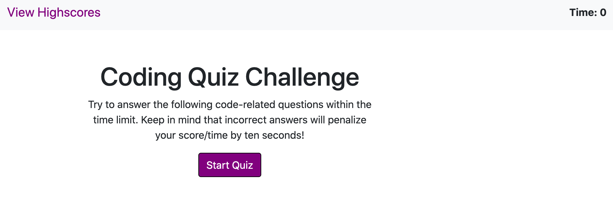
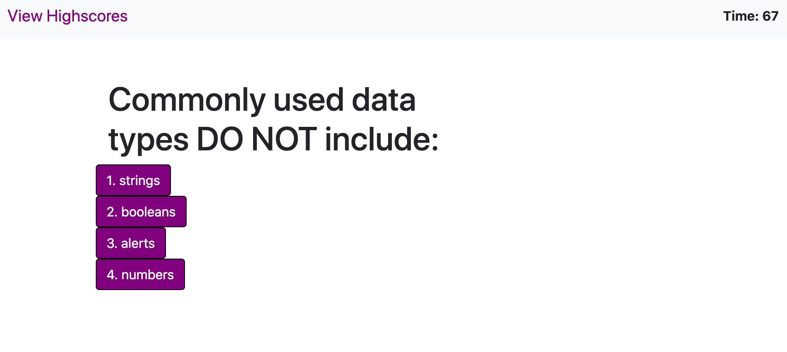
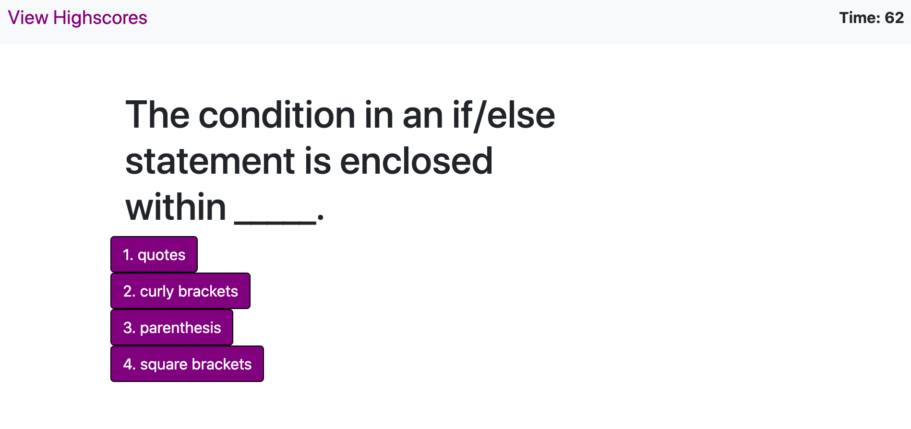
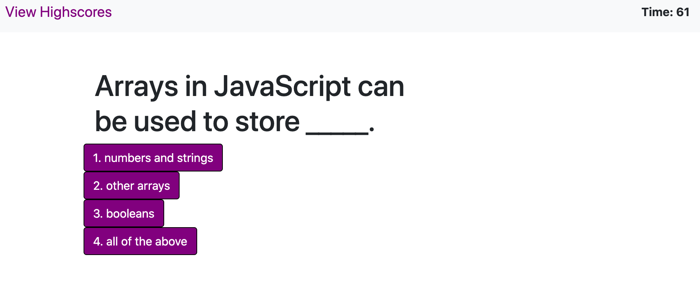
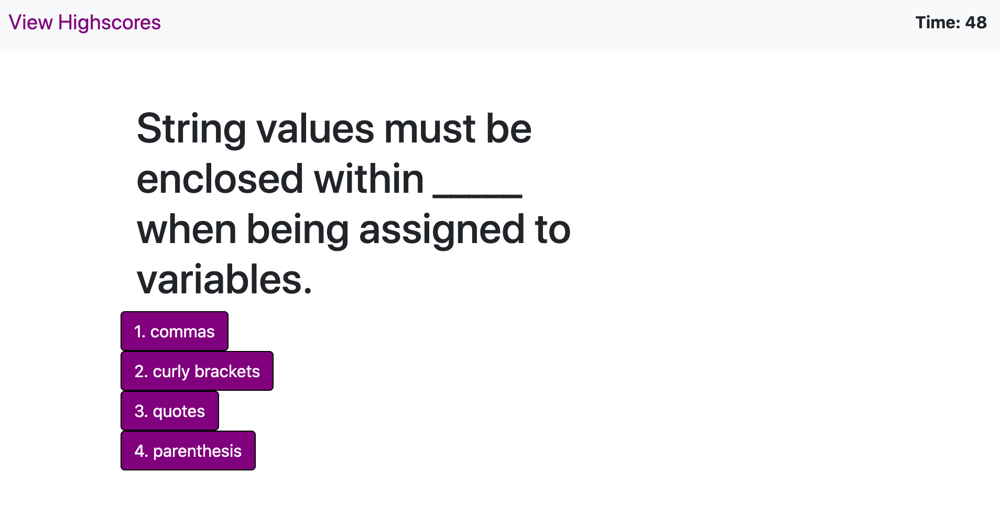
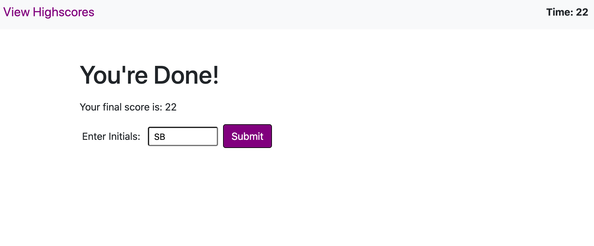
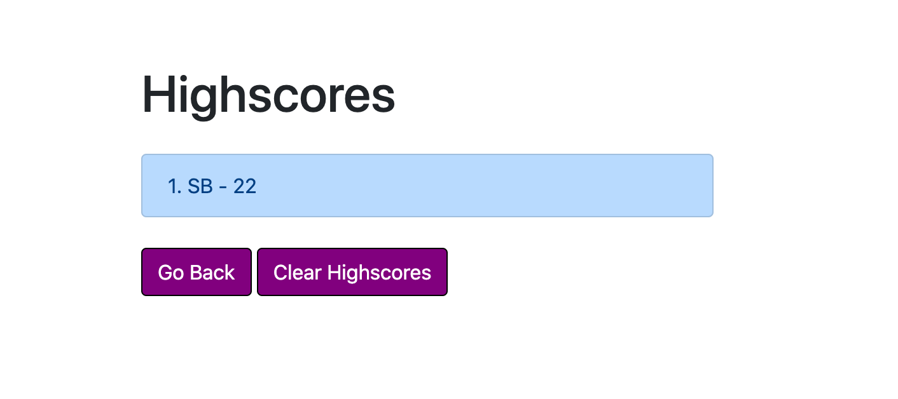
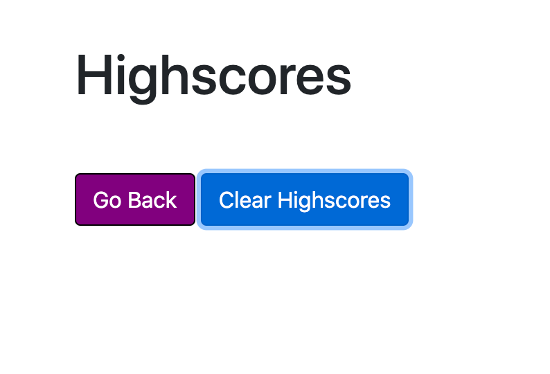

# ass_cha_4

<h1> Web APIs Challenge: Code Quiz</h1>
<h2>User Story</h2>

AS A coding boot camp student
I WANT to take a timed quiz on JavaScript fundamentals that stores high scores
SO THAT I can gauge my progress compared to my peers

<h2>Acceptance Criteria</h2>

GIVEN I am taking a code quiz 
WHEN I click the start button 
THEN a timer starts and I am presented with a question 
WHEN I answer a question 
THEN I am presented with another question 
WHEN I answer a question incorrectly 
THEN time is subtracted from the clock 
WHEN all questions are answered or the timer reaches 0 
THEN the game is over 
WHEN the game is over 
THEN I can save my initials and score

<h2>Mock-Up</h2>

The following animation demonstrates the application functionality:
 
  
 
 
 
 
 
 
 
